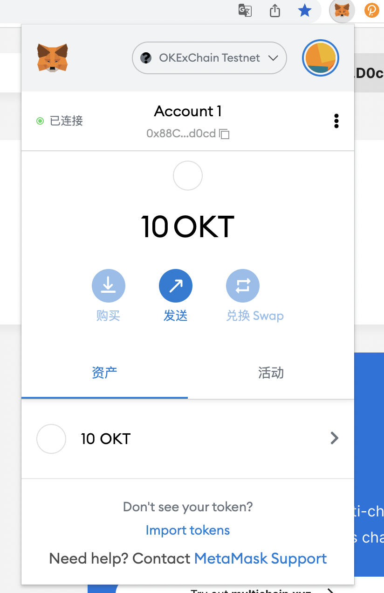
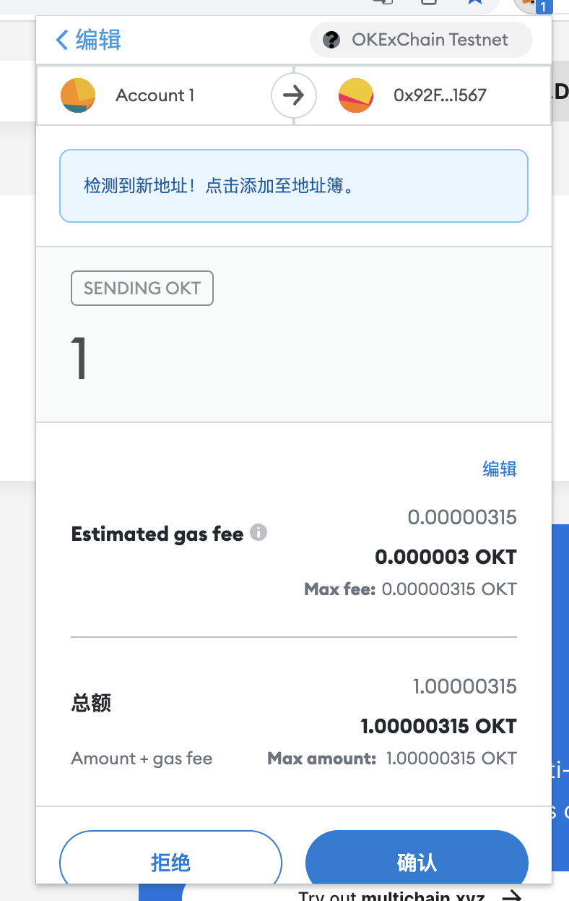
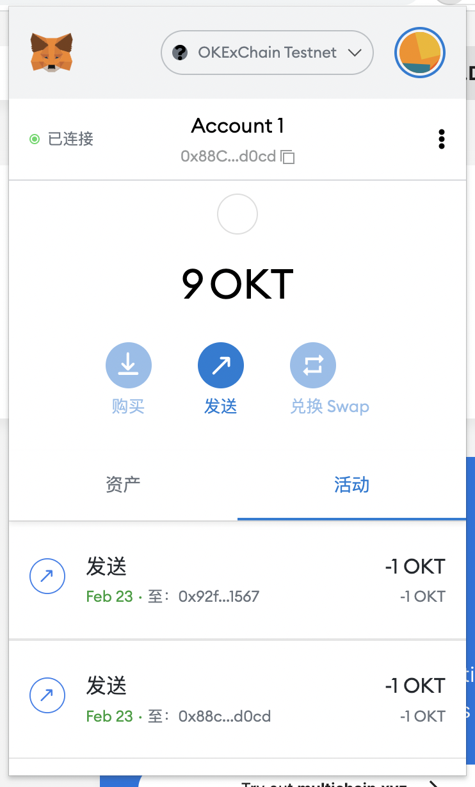
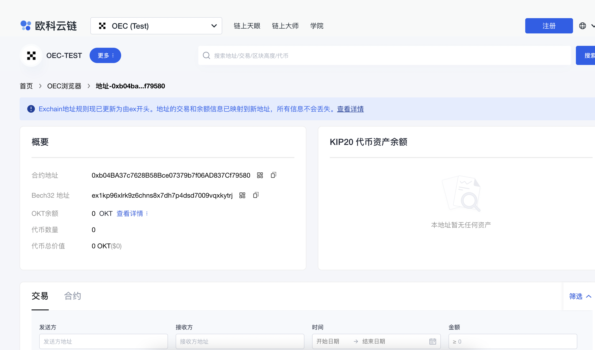
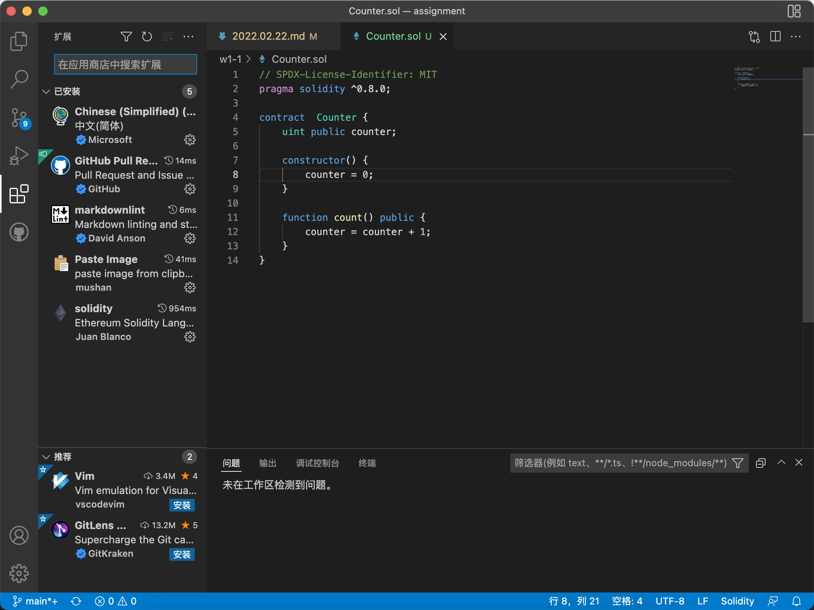

# 2022.02.22-W1-1作业

## 安装 Metamask、并创建好账号

创建账号完成

## 执行一次转账

转账完成

从地址 0x88Cece37468106ab0f4c9060959788367f14d0cd 转账 1 OKT 到地址 0xb04BA37c7628B58Bce07379b7f06AD837Cf79580

## 使用 Remix 创建任意一个合约

创建合约成功，并且成功部署到 OKExChain Testnet

合约地址：0xb04BA37c7628B58Bce07379b7f06AD837Cf79580

## VSCode IDE 开发环境配置

VSCode 开发环境配置成功

## 使用 Truffle 部署 Counter 合约 到 test 网络（goerli）（提交交易 hash
