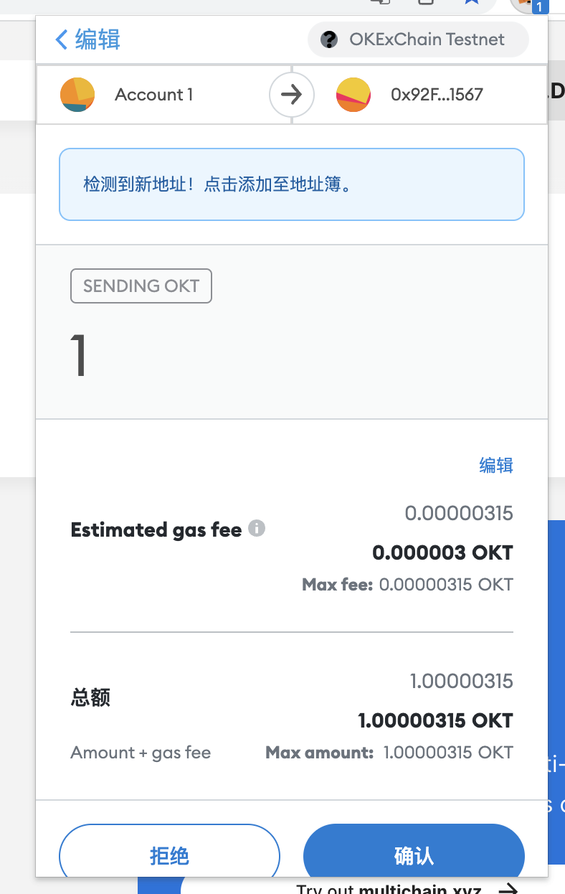
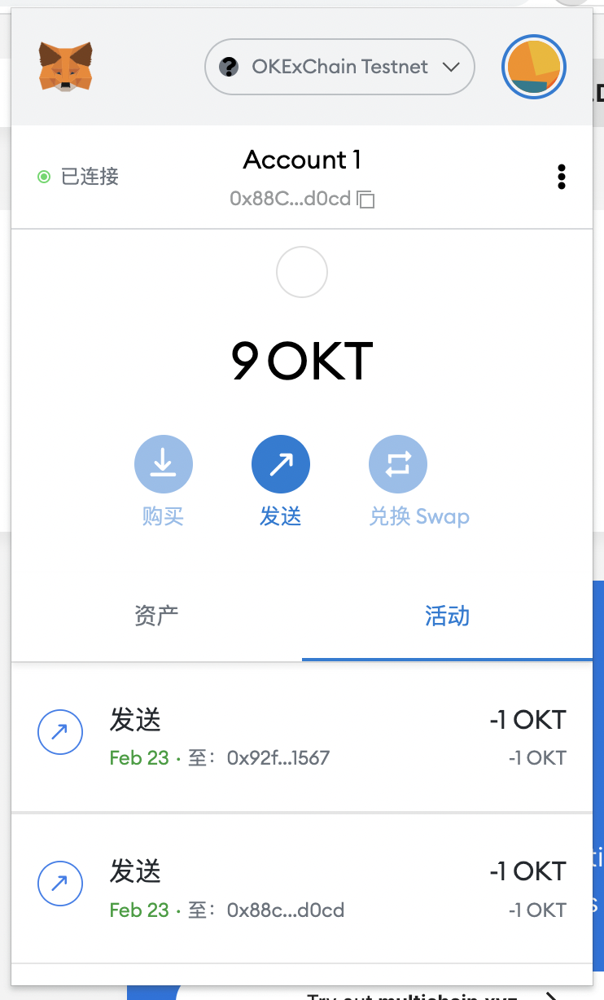
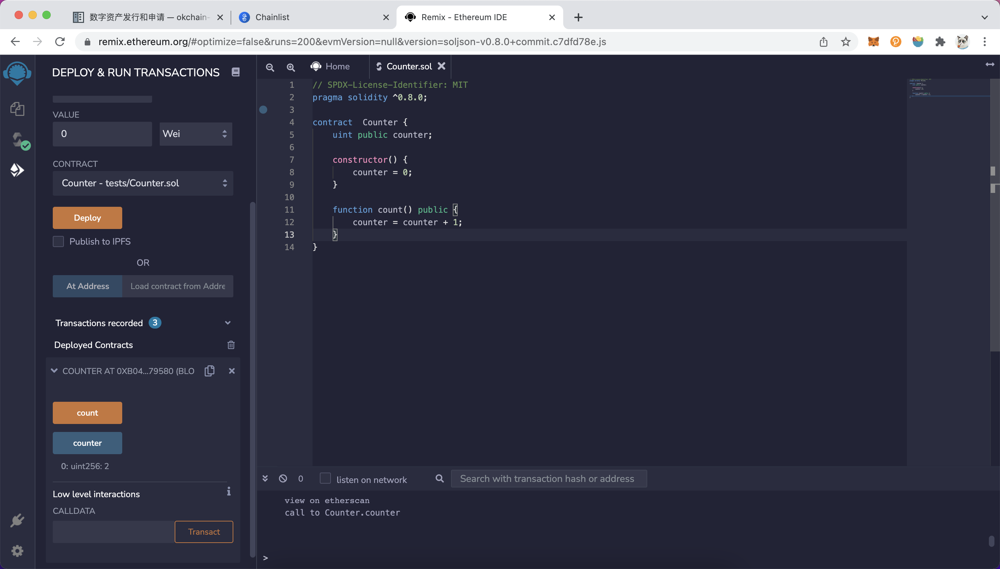
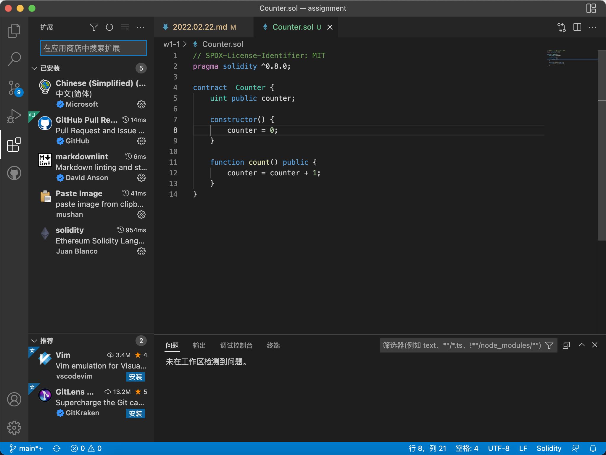
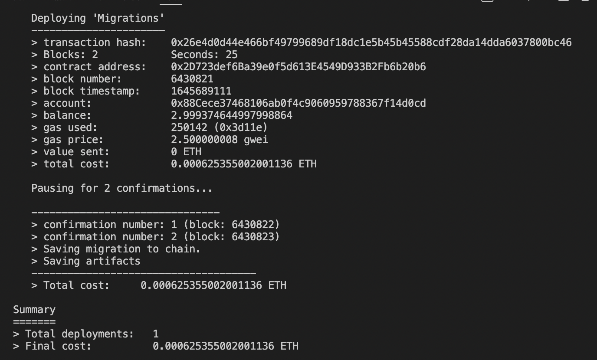
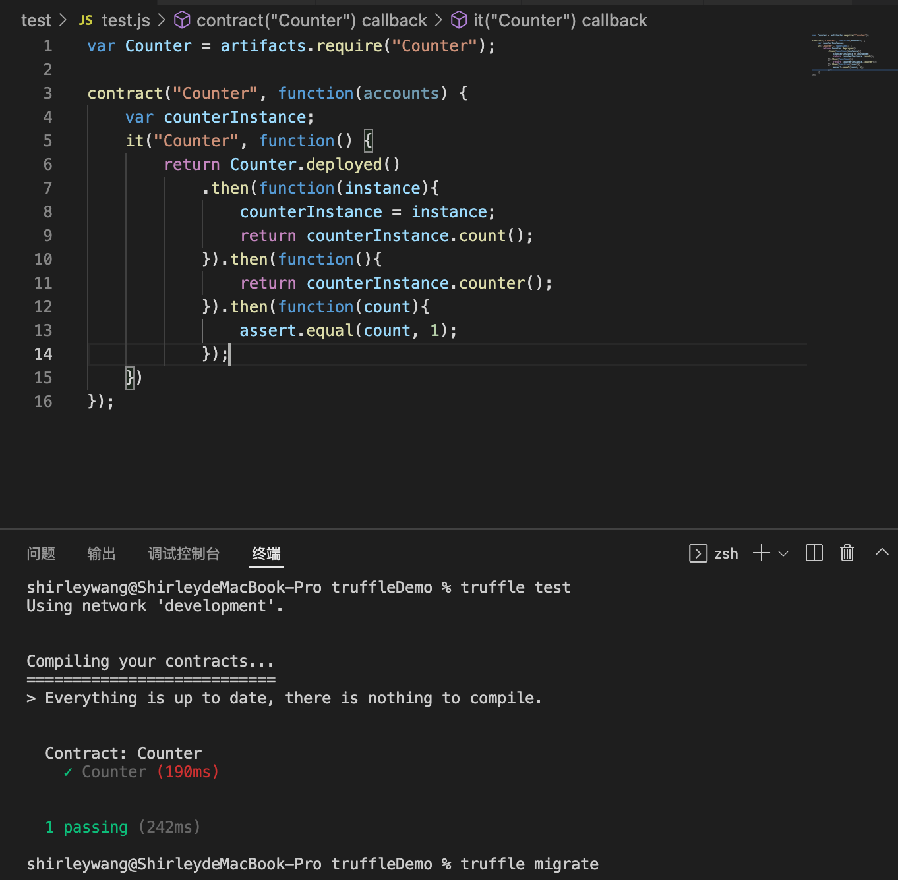

# 2022.02.22-W1-1作业 📔

## 1.安装 Metamask、并创建好账号

✅ 创建账号完成

## 2.执行一次转账

✅ 转账完成

✅ 从地址 0x88Cece37468106ab0f4c9060959788367f14d0cd 转账 1 OKT 到地址 0xb04BA37c7628B58Bce07379b7f06AD837Cf79580

## 3.使用 Remix 创建任意一个合约

✅ 创建合约成功，并且成功部署到 OKExChain Testnet

合约地址：0xb04BA37c7628B58Bce07379b7f06AD837Cf79580

## 4.VSCode IDE 开发环境配置

✅ VSCode 开发环境配置成功

## 5.使用 Truffle 部署 Counter 合约 到 test 网络（goerli）（提交交易 hash）

✅ 成功使用truffle 部署counter 到 goerli 网络

transaction hash:    0x26e4d0d44e466bf49799689df18dc1e5b45b45588cdf28da14dda6037800bc4

## 编写一个测试用例

✅ 完成测试用例编写并且完成测试

