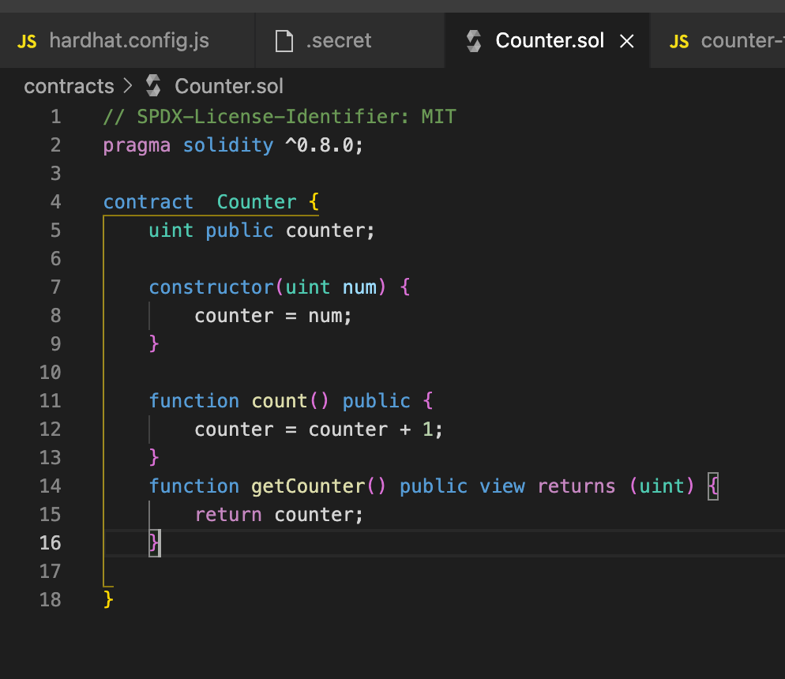
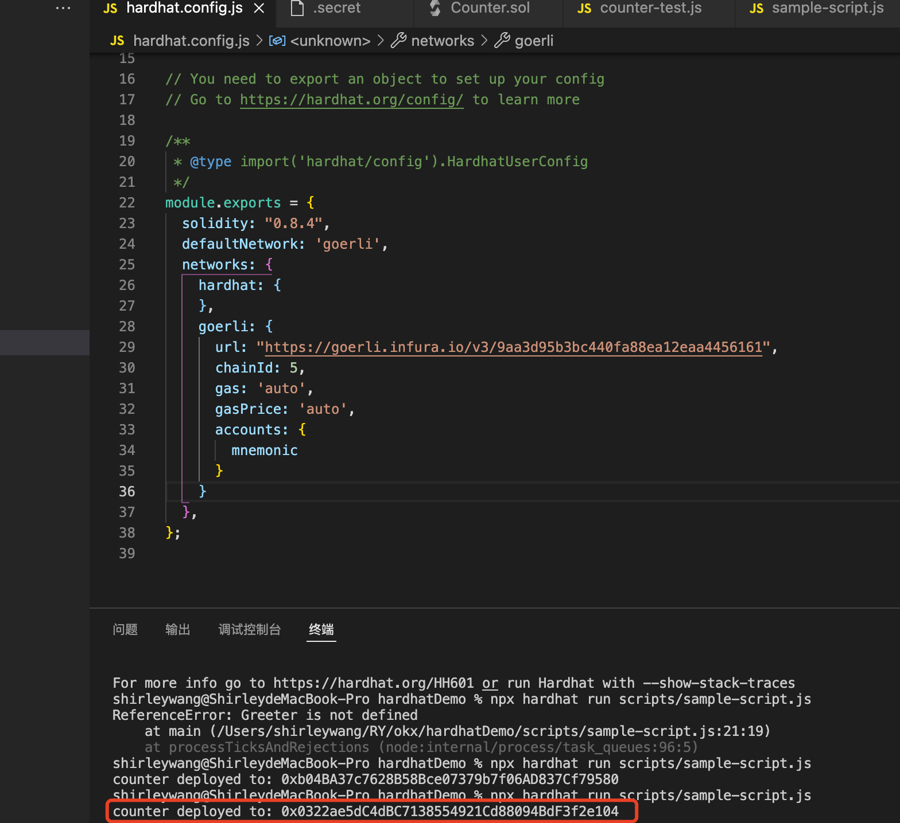
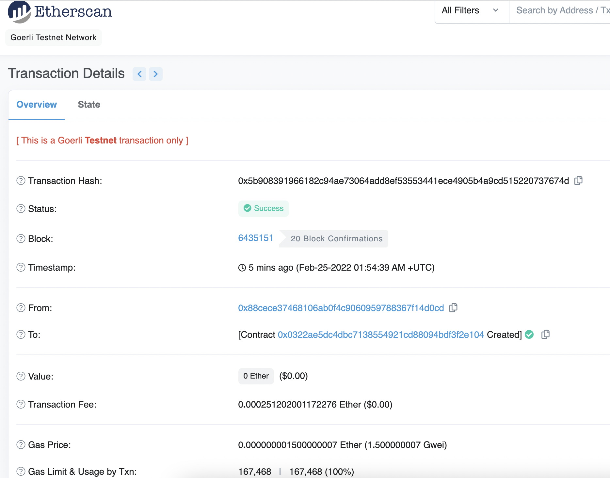
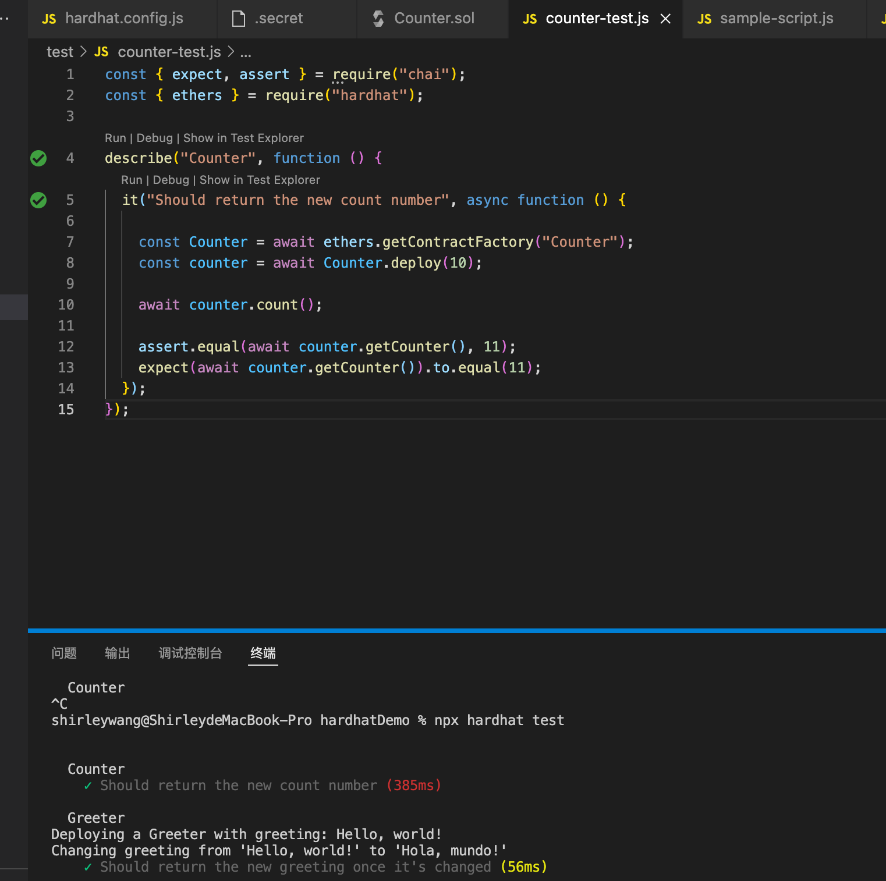
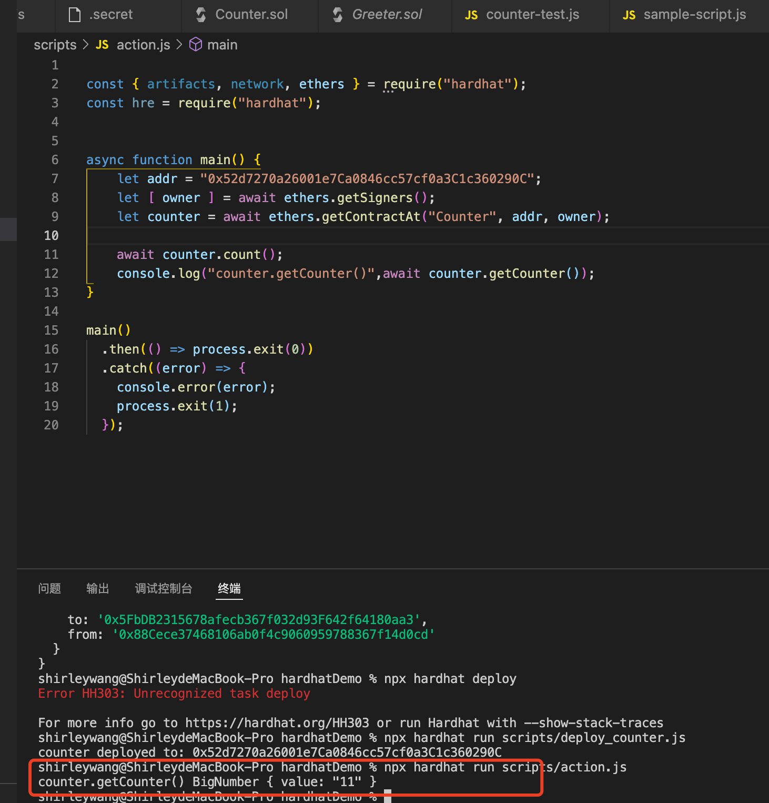

# 2022.02.24-W1-2作业 📔

## 1. 使用 Hardhat 部署修改后的 Counter

✅ 完成修改 Counter

✅ 完成部署到 Goerli 网络

Contract: 0x0322ae5dc4dbc7138554921cd88094bdf3f2e104

Transaction Hash: 0x5b908391966182c94ae73064add8ef53553441ece4905b4a9cd515220737674d

## 2. 使用 Hardhat 测试 Counter

✅ 完成 Counter 测试编写, 并通过测试

## 3. 写一个脚本调用 count()

✅ 完成脚本编写, 并测试成功

