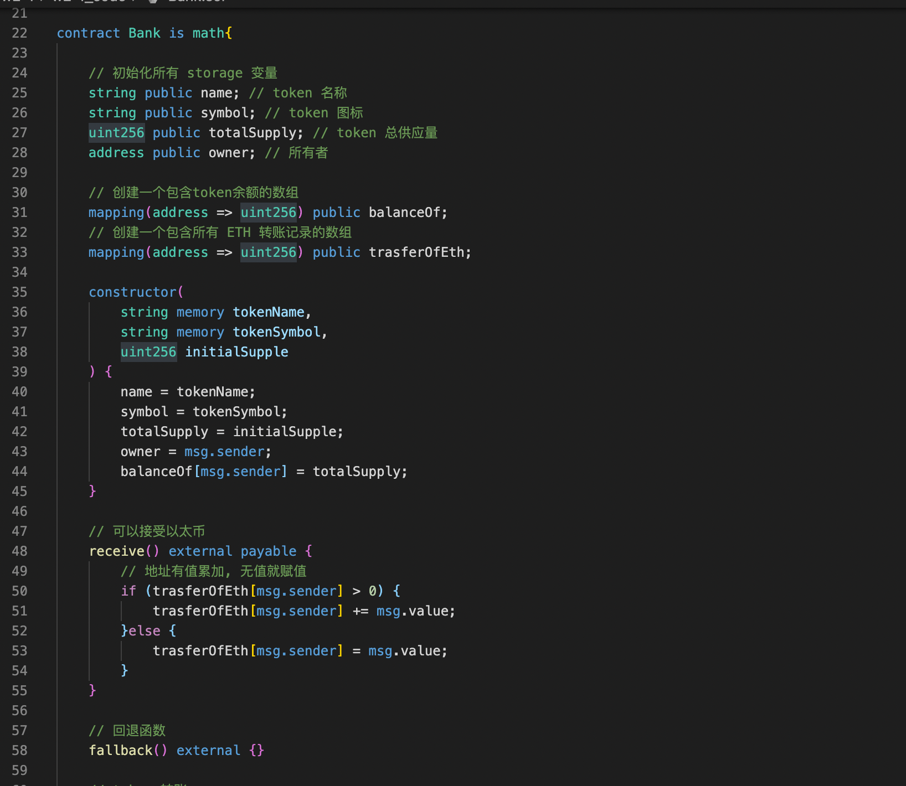
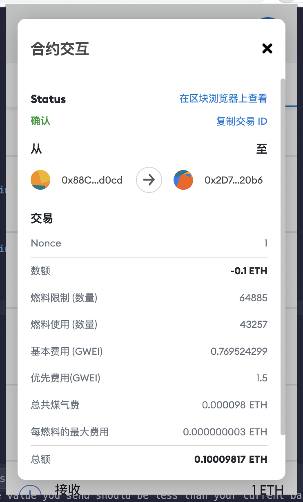
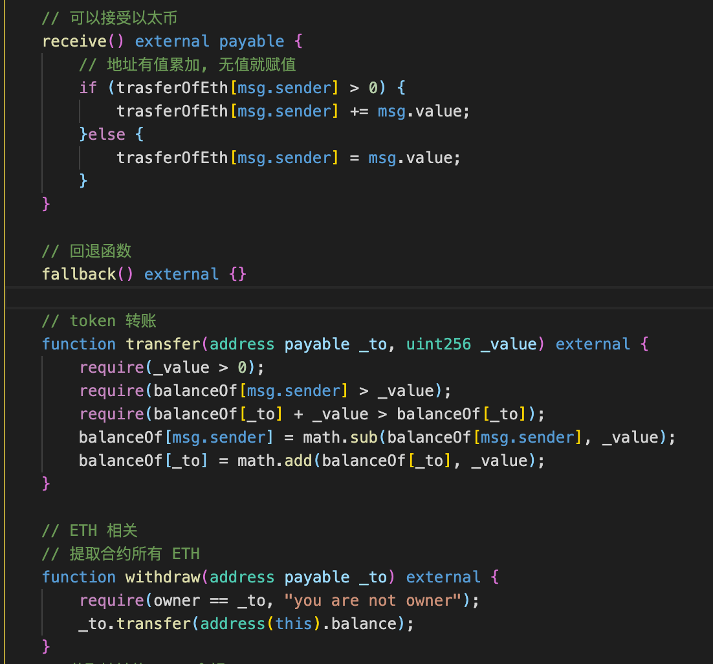
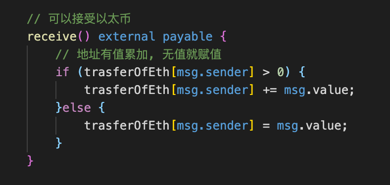
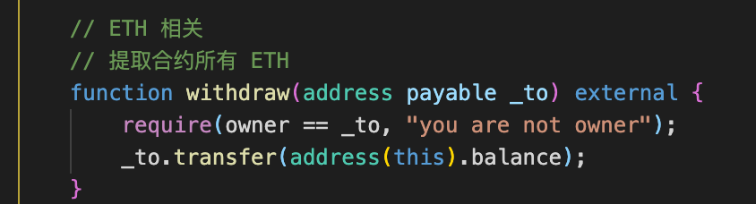

# 2022.03.01-W2-1作业 📔

## 1. 编写一个 Bakn 合约

✅ 完成 Bank 合约编写

详细代码请浏览 w2-1_code 里面的 Bank.sol

## 2. 通过 Metamask 向 Bank 合约转账 ETH

✅ 完成 Metamask 向合约转账

详细代码请浏览 w2-1_code 里面的 Bank.sol

## 3. 在 Bank 合约记录每个地址转账金额

✅ 完成在合约记录每个地址转账金额

详细代码请浏览 w2-1_code 里面的 Bank.sol

## 4. 编写 Bank 合约 withdraw(), 实现提取出所有的 ETH

✅ 完成 withdraw() 编写

