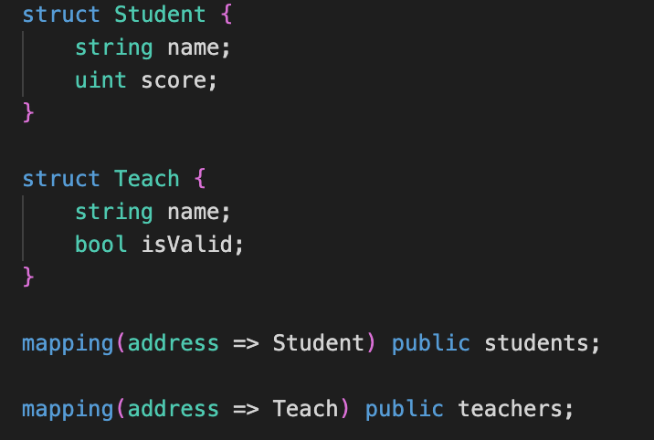
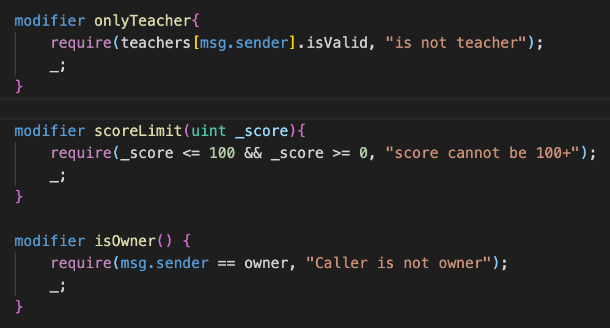
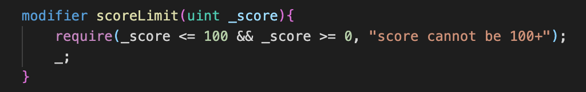
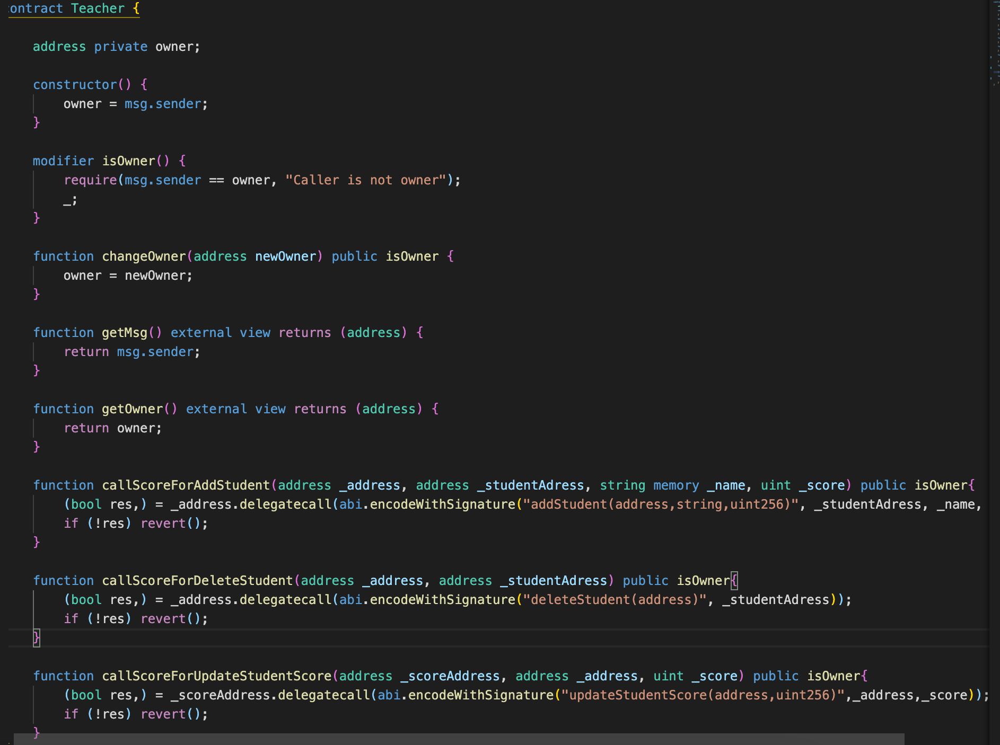

# 2022.03.01-W2-2作业 📔

## 1. 编写合约Score，⽤于记录学⽣（地址）分数：

✅ 完成 Score 合约编写

* 新建 struct student 结构体, 定义学生名字和分数
* 新建 mapping studenrs , 储存学生名字和分数

    

### 仅有⽼师（⽤modifier权限控制）可以添加和修改学⽣分数

* 定义 modifier 限制只有老师能修改分数

    

### 分数不可以⼤于 100

✅ 完成 modifier 编写

## 编写合约 Teacher 作为⽼师，通过 IScore 接⼝调⽤修改学⽣分数。

✅ 完成 Teacher 合约编写

* 通过 IScore 接⼝调⽤修改学⽣分数(代码详细见代码文件)

