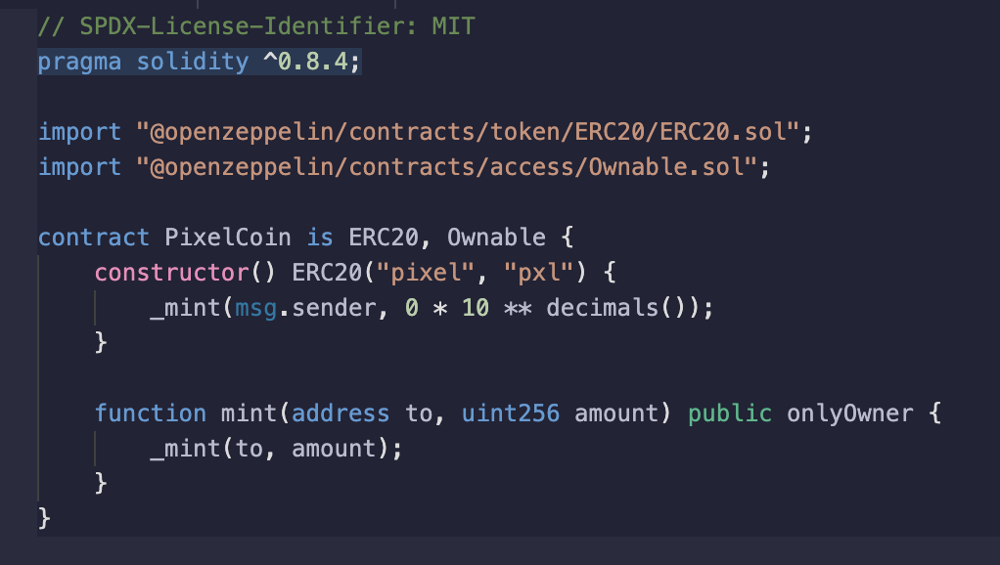

# 2022.03.01-W3-1作业 📔

## 1. 发行一个 ERC20Token

✅ 完成 ERC20Token 发行, 可动态增发(起始发行量是 0), 部署到测试网

### 通过 ethers.js. 调用合约进行转账

## 2. 编写一个Vault 合约

### a).编写deposite 方法，实现 ERC20 存入 Vault，并记录每个用户存款金额 ， 用从前端调用(Approve，transferFrom)

### b).编写 withdraw 方法，提取用户自己的存款 (前端调用)

### c).前端显示用户存款金额