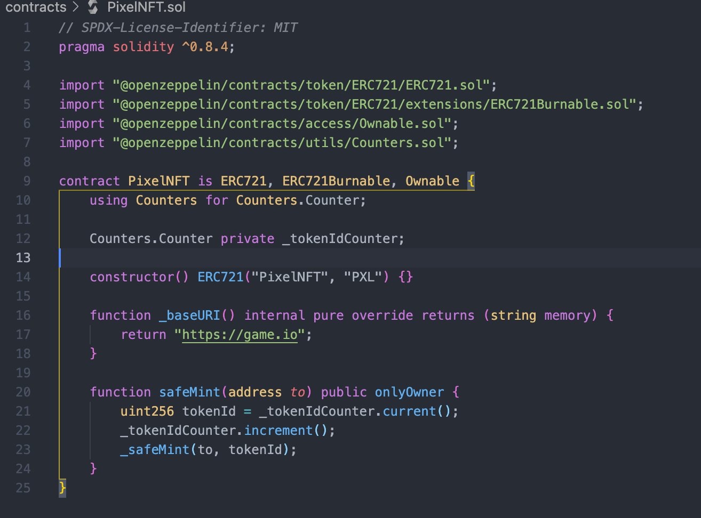
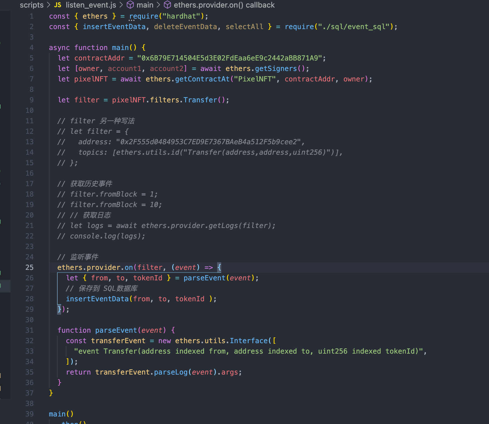
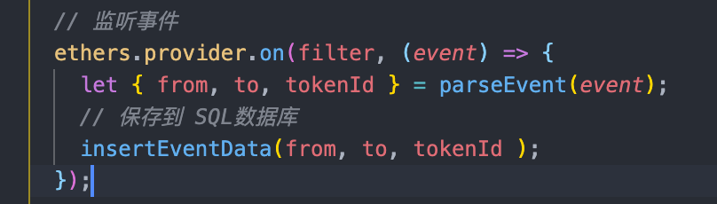
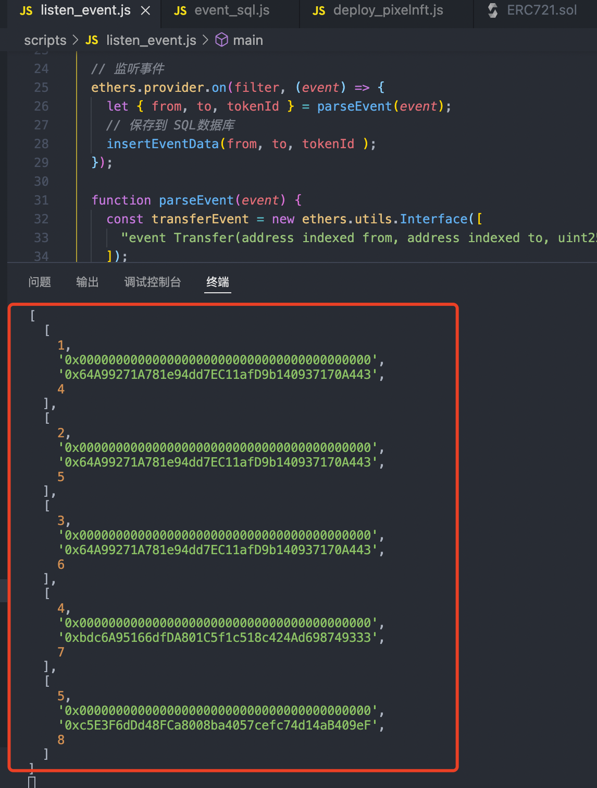

# 2022.03.01-W3-1作业 📔

## 1. 发⾏⼀个 ERC721 Token

✅ 完成 ERC721 Token 发行

代码见 [PixelNFT.sol](https://github.com/ruiuu/assignment/blob/main/w3-2/w3-2_code/PixelNFT.sol)

  

### a) 使⽤ ethers.js 解析ERC72转账事件

✅ 完成 ethers.js 解析转账事件

代码见 [listen_event.js](https://github.com/ruiuu/assignment/blob/main/w3-2/w3-2_code/listen_event.js)

### b) 记录到数据库中，可⽅便查询⽤户持有的所有 NFT

✅ 完成 监听事件, 调用 insertEventData 方法存入数据库

✅ 完成事件数据入库

代码见 [event_sql.js](https://github.com/ruiuu/assignment/blob/main/w3-2/w3-2_code/event_sql.js)

数据库数据打印 column(id, form, owner, tokenId)

