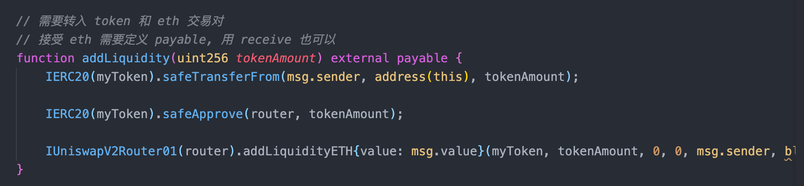

# 2022.03.15-W4-1作业 📔

## 1. 部署自己的 ERC20 合约 MyToken

✅ 完成 ERC20 合约 MyToken 部署

  

## 2. 编写合约 MyTokenMarket 实现

✅ 完成 MyTokenMarket 实现

### a). AddLiquidity():函数内部调用 UniswapV2Router 添加 MyToken 与 ETH 的流动性

### b). buyToken()：用户可调用该函数实现购买 MyToken

