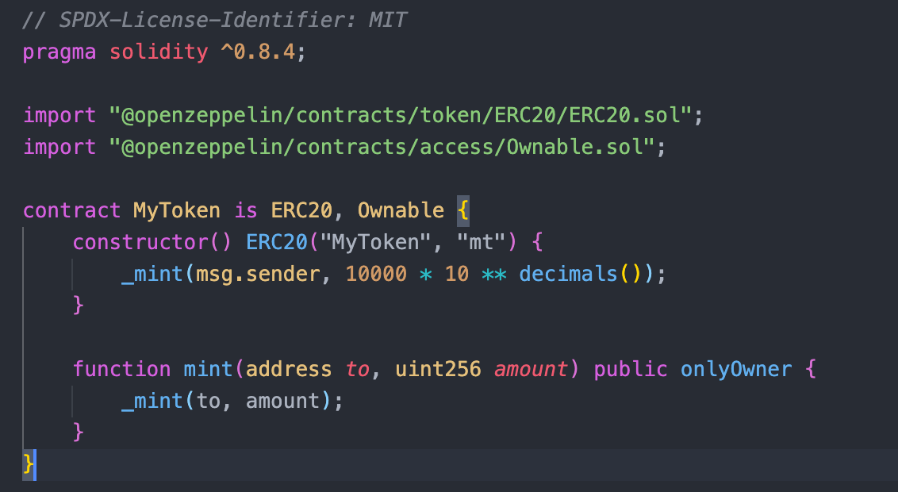
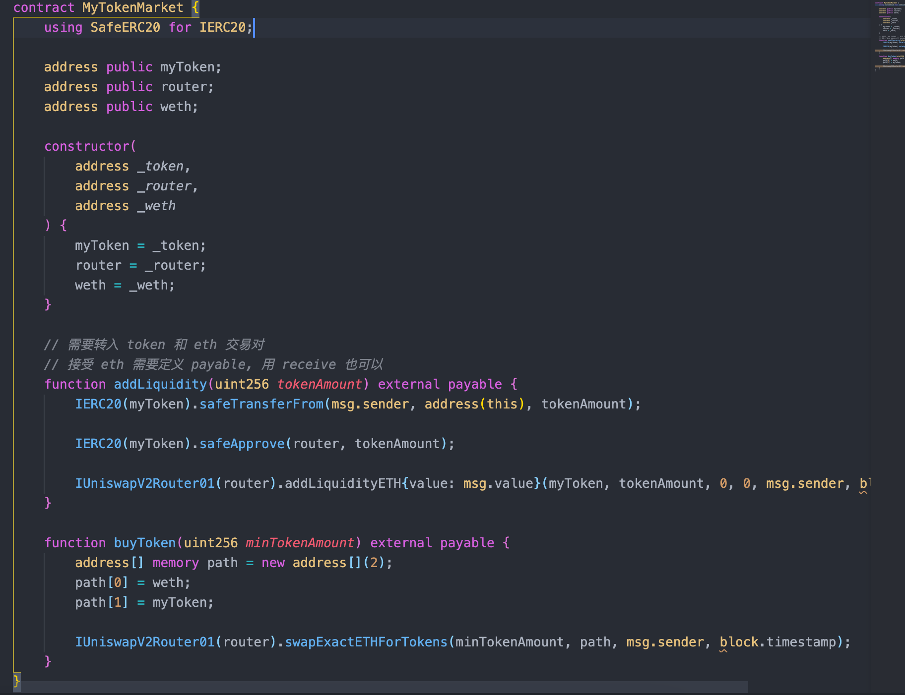
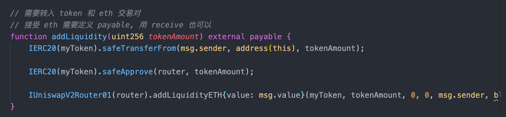
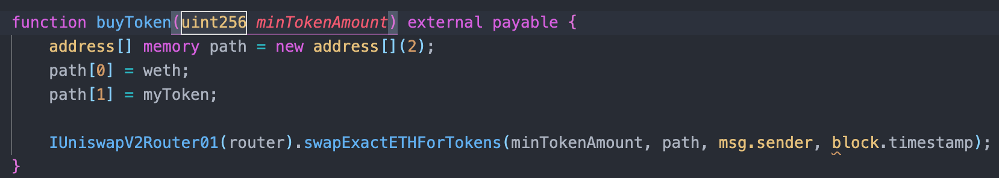
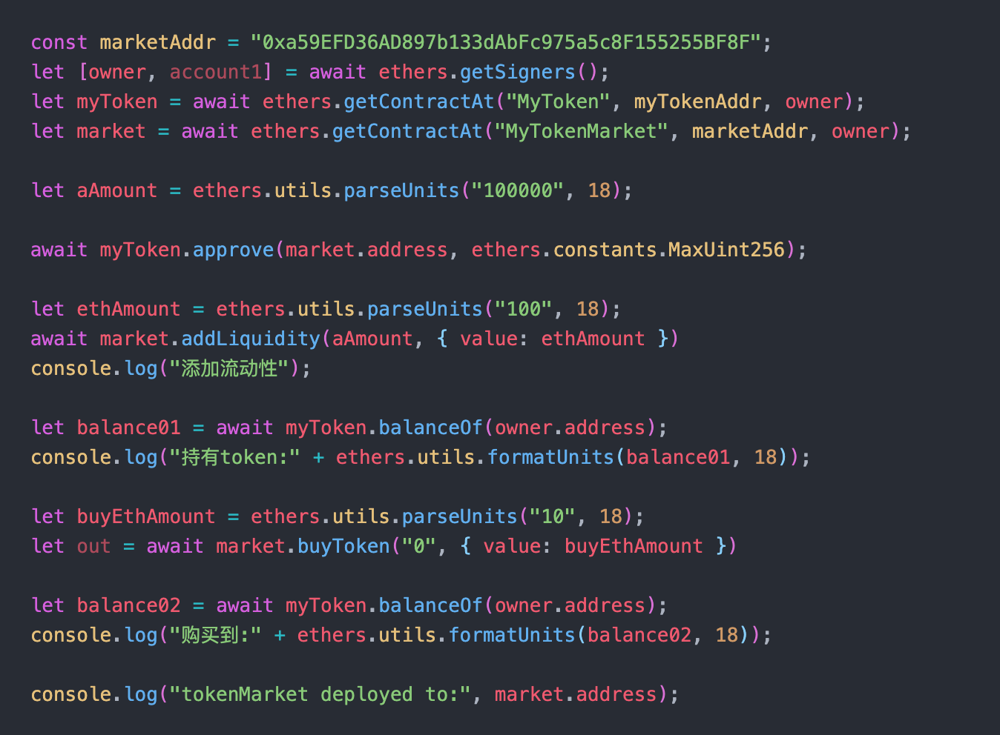

# 2022.03.15-W4-1作业 📔

## 1. 部署自己的 ERC20 合约 MyToken

✅ 完成 ERC20 合约 MyToken 部署

  

## 2. 编写合约 MyTokenMarket 实现

✅ 完成 MyTokenMarket 实现

### 部署步骤
1. 首先部署 erc20 token 合约
2. 再部署 WETH 合约
3. 部署 factory 合约, 构造传入一个 feeto 地址
4. 部署 router 合约, 需要用到 fatory 合约地址和 weth 合约地址
5. 最后部署 myTokenMarket 合约, 需要传入 erc20 token 合约, 路由合约地址, weth 合约地址

### a). AddLiquidity():函数内部调用 UniswapV2Router 添加 MyToken 与 ETH 的流动性

### b). buyToken()：用户可调用该函数实现购买 MyToken

脚本调用

